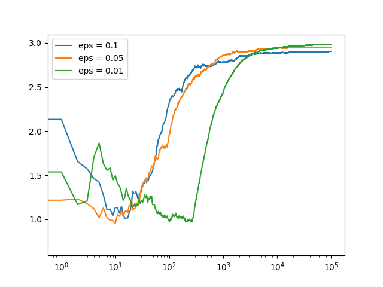

Epsilon-Greedy

A common approach to balancing the exploitation-exploration trade-off is the epsilon- or e-greedy algorithm.
After an initial period of exploration (for example 1000 trials), the algorithm greedily exploits the best option k, e percent of the time.  

In the 'comparing_epsilons.py', there are three bandits with different variant of 1, 2, and 3.
If we set e = 0.05, the algorithm will exploits the best variant 95% of time and will explore random alternatives 5% of the time. 

This is actually quite effective in practice.

